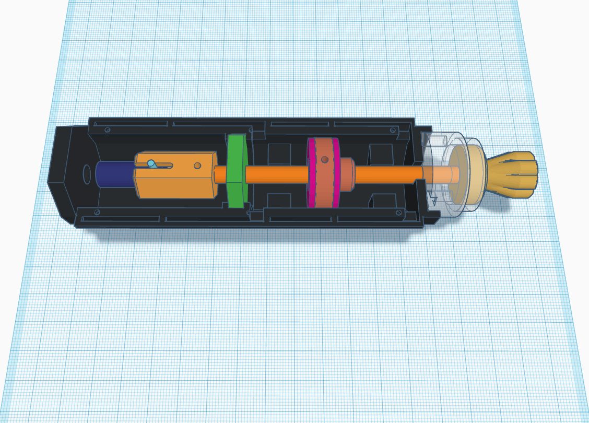

# Rotary Buttons with Push Pull Function
This part covers the assembly of the Rotary Button with Push Pull function.

## Parts needed
- 16 [8x8 Non-Self-Locking Taster with Black Cap](https://de.aliexpress.com/item/4001159367703.html?spm=a2g0o.cart.0.0.5fbb4ae4lgbDyt&mp=1&gatewayAdapt=glo2deu)
- Rubber mat 2mm
- 6mm Brass Shaft approx 4x125mm
- 4x 20x2mm Steel Pin
- 4x [Rotary Encoder](https://de.aliexpress.com/item/1005002358274622.html?spm=a2g0o.cart.0.0.5fbb4ae4dFC68d&mp=1&gatewayAdapt=glo2deu)
- 12x [Warm White LED 3x3mm Flat Top](https://de.aliexpress.com/item/32757762886.html?spm=a2g0o.cart.0.0.230b4ae42b9wfW&mp=1&gatewayAdapt=glo2deu)
- Wiring Material
- Rapid glue

## Vorschau

[Finished assembly](./Images/)

## Assembly
It is recommended to assemble 1 knob first as a test. And then learn from your mistakes.
1. print all 3D parts
2. glue the two parts of the button together
3. take a 6mm drill and drill the Light Pipe Support and the Centre Support (photo green) a little bit bigger. The brass rod must go through without friction. 
4. Glue the transparent part on the housing. ATTENTION: Put a LED in the lower cutout before, otherwise you won't be able to reach it.
5. install the encoder
6. glue the steel pin into the encoder pin. (photo cyan and dark blue)
7. glue the punched out rubber mat (photo pink) on the push pull disc.
8. put everything together carefully and check if the brass rod has the right length. If not, shorten the rod.
9. Remove everything except the encoder pin. 
10. put super glue in the hole of the encoder slide and put the encoder slide on the encoder pin
11. insert Centre Support
12. insert brass rod and don't forget the push pull disc!!!
13. glue brass rod and Encoder Slide together
14. wire the push button and glue it. Make sure that the Push Pull Disc is still free to move after gluing in the push buttons. Approx. 1mm distance
15. Push the brass rod almost all the way to the back. Approx. 1mm distance
16. push the push pull disc backwards. Operate the push mechanism and glue the push pull disc in the same way. 
17. After the glue has dried, operate the push mechanism again and glue the knob flush with the light pipe in this state.

If everything is done correctly, you can turn the knob and feel the steps of the encoder. In addition, you can press the push-pull mechanism and it will return to its original position by itself.

## Electrical assembly
All parts are connected to GND. This means that the middle pin of the encoder has to be connected to GND and the pushbuttons also all need GND. The push buttons have to be connected in parallel. So the push buttons for push together and the push buttons for pull together.

Pin Arduino | Description
---------------------------
22	        | Altitude left
23	        | Altitude right
24	        | Push Altitude
25	        | Pull Altitude
26	        | Speed left
27	        | Speed right
28	        | Push Speed
29	        | Pull Speed
30	        | VS left
31	        | VS right
32	        | Push VS
33	        | Pull VS
34	        | HDG left
35	        | HDG right
36	        | Push HDG
37	        | Pull HDG
